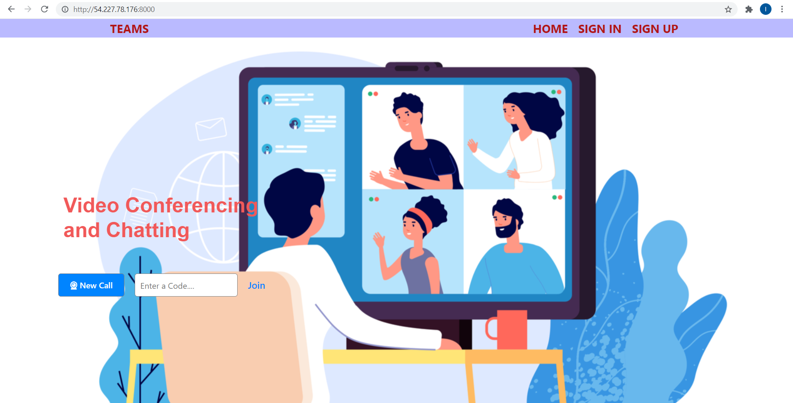
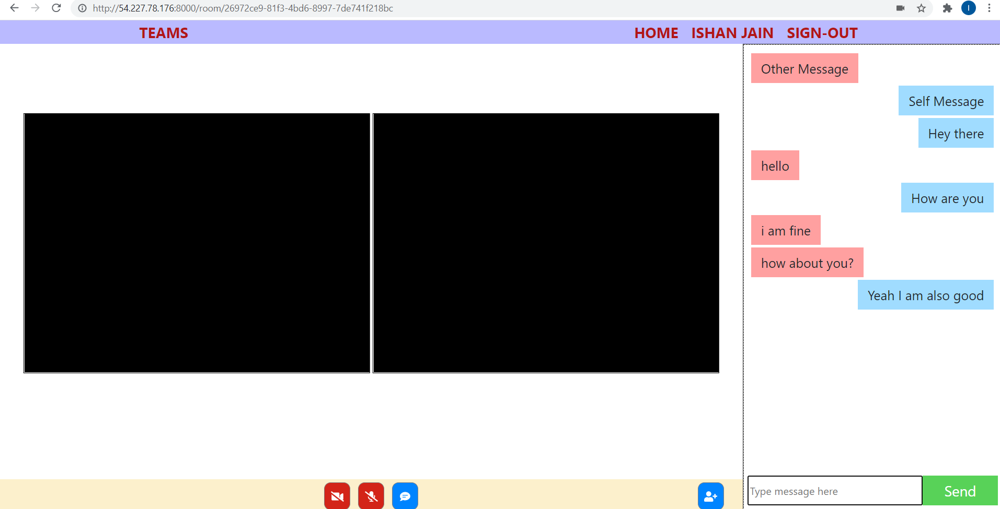
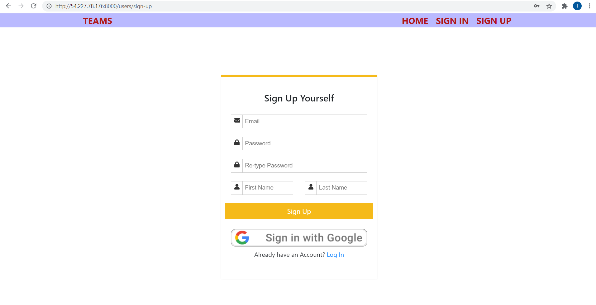
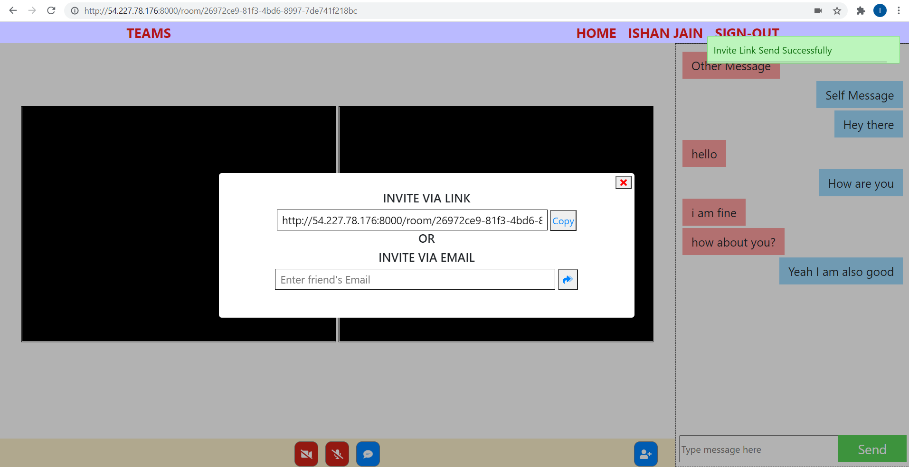

# Video Conferencing and Chatting

## Description
Building Microsoft Teams Clone for smooth Video Conferencing and Chatting with friends with Authentication of users and automaticb invite email feature.

## Screenshots

## Technologies Stack:

### Components
- Node.js,MongoDB,Express.js,EJS
- Socket.io,Peer.js
- Javascript,AJAX,jquery
- Sass,css
- Nodemailer
- Notyjs
- uuidv4

### Insights
- used socket.io and Peerjs for implementing Video call and Chat.
- Camera and Microphone turn on/off feature.
- button for hiding and enlarging the chat box
- uuidv4 for generating random urls.
- passport-jwt strategy for authentication and authorization.
- passport-google-oauth2 strategy for social authentication through google.
- used Nodemailer to send out emails.
- used morgan to make production logs
- Notyjs for display notifications

### How to install
- Clone the project onto your local machine.
- Then cd videochat
- npm install to install dependencies
- globally install nodemon
- nodemon index.js = to run server in development mode
- npm run prod_start = to run server in production mode
- Visit your app at http://localhost:8000
